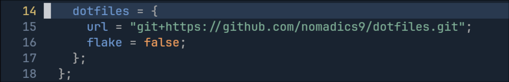

<h1 align="center">Nomadics NixOS</h1>

<div align="center">

    </div>


- Hyprland
- Waybar
- Wofi
- Hyprlock + Hypridle
- Zsh
- Wayland
- Nightfox theme
- Simple <b>GPU - Passthrough</b> Module

## Screenshots


#### All Keybinds ```SUPER + F1```


## Installation
1. [Download NixOS](https://nixos.org/download/)
2. Gnome recommended for graphical installation.
3. ```git clone https://github.com/nomadics9/nixcfg.git```
4. ```cd nixcfg```
5. ```sudo bash install.sh``` and follow the installer.
* Known issue. sometimes you will get ```/boot/efi``` is not mounted partition error. In that case.
<br>
<br>
    One liner, just change YOUR-HOSTNAME accordingly to your hostname
<br>
```sed -i 's|boot.loader.efi.efiSysMountPoint = "/boot/efi";|boot.loader.efi.efiSysMountPoint = "/boot";|' ./hosts/YOUR-HOSTNAME/configuration.nix```
<br>
<br>
or
<br>
<br>
    Manually 
<br>
```nano ./hosts/YOUR-HOSTNAME/configuration.nix``` change line 33 from ```boot.loader.efi.efiSysMountPoint = "/boot/efi";``` path to just <b>```/boot```</b>


## Configurations - optional
For user packages you will find them in ```home/nomad/home.nix```. You can remove all packages here or keep them nothing is dependent on them.
<br>


#### Nvidia users
You might want to check ```hosts/unkown/hardware/nvidia.nix``` and change these values accordingly. 


#### GPU - Passthrough VM
You <b>MUST</b> check and configure ```hosts/common/services/vfio.nix``` accordingly its straight forward if you follow the comments.

#### Link your dotfiles from github repo
Right now the flake is configured to pull dotfiles and scripts from [Here](https://github.com/nomadics9/dotfiles). Fork this repo adjust as you like and change ```flake.nix``` dotfiles url to point to your repo.



## Todo

- Add more dotfiles? firefox's for example

<details>
<summary><h4>Layout</h4></summary>

```
nixcfg/
├── home/
│   ├── common/
│   ├── features/
│   |   ├── cli
│   |       ├── fzf.nix
│   |       ├── neofetch.nix
│   |       ├── zsh.nix
│   |   ├── desktop/
│   |       ├── fonts.nix
│   |       ├── hyprland.nix
|   |       ├── wayland.nix
|   |       ├── xdg.nix
|   |   ├── themes/
|   |       ├── gtk.nix
|   |       ├── qt.nix
│   ├── nomad/
|       ├── dotfiles/
|           ├── bat.nix
|           ├── default.nix
|           ├── dunst.nix
|       ├── home.nix
|       ├── unknown.nix
│
├── hosts/
│   ├── common/
|   |   ├── services
|   |       ├── appimage.nix
|   |       ├── nautilus.nix
|   |       ├── polkit.nix
|   |       ├── steam.nix
|   |       ├── vfio.nix
|   |       ├── vm.nix
|   |       ├── xdgportal.nix
|   |   ├── users
|   |       ├── nomad.nix
│   ├── unkown/
│       ├── hardware/
|       |   ├── battery.nix
|       |   ├── nvidia.nix
│       ├── configuration.nix
│       ├── hardware-configuration.nix
│
├── overlays/
├── pkgs/
├── flake.lock
├── flake.nix
├── install.sh
├── README.md
```
</details>

[](https://hits.seeyoufarm.com)
